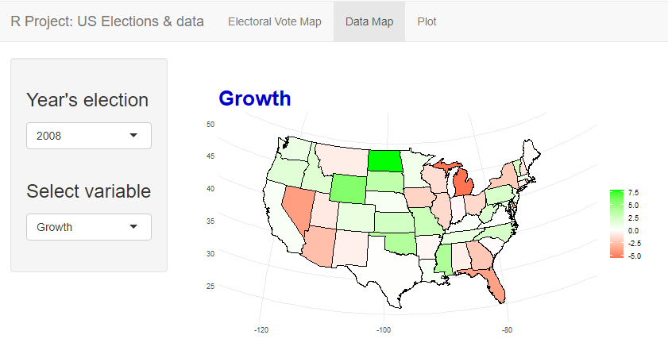

US Elections & Data from 1980 to 2020
================

## Introduction

This code has been written for the midterm exam on R of *Coding for Data
Science*. The aim is to build a **Shiny App**, so that a user interface
is generated and the client can change the data shown to its wishes. The
data presented with this project are mainly the ones gathered from the
exam of Microeconometrics, each variable is described in the chapter
*Variables*.

Use runGitHub("RobertoStaino/UsMapAndData") on R to run the app.

## The App

The Shiny App built is divided into three main pages. 

The first one is a map of the United States of America colored in a
shade from red to blue. It’s possible to choose between three main
variables of interest and the year. It’s important to note that the main
variable is the share of Democrats, so the share of Republicans is not
computed but it’s perceivable from the user. The more blue a state is,
the higher is the electoral vote collected by the Democrats, viceversa
for the Republicans that are coloured in red. 

The second one is again a map of the USA, but the variables to choose
from are **not** the electoral ones. Further details of each variable is
given in the next chapter. Colours are given by the code and it changes
between variables. 

The last page is composed by a **barplot** and it’s possible to choose
throughtout each state to see the actual value for each variable.
However, it is not suggested to select too many states at once because
Shiny doesn’t give the possibility to expand the plot. 

As last mention, to build this app it has been necessary to remove three
states from the dataset. **Hawaii** and **Alaska** are not represented
in the map. And finally, the **District of Columbia** is huge outlier
for many variables such as *Density* and it’s not even visible on the
graphic map of ggplot.

## Variables

The dataset is a panel, that goes from **election’s year 1980 to 2020**,
divided by a four year step because of the longevity of the US President
mandate.

#### Electoral Variables

**Party share (Democrats share)**: it has been computed by the
percentage of how many votes (popular vote) out of the 2-party vote
(democratic party and republican party only).

**Midterm Election (Democrats share)**: it represents the share of
democrats in the midterm election, that takes place two year before the
presidential election taken into consideration, for the House of
Representatives, out of the two-party share of votes so Democratic Party
and Republican Party only. The share of the democrats includes votes for
the Democratic party and his affiliates state parties (North Dakota
Democratic–Nonpartisan League Party and the Minnesota
Democratic–Farmer–Labor Party). The midterm data are taken from 1978
to 2018.

**Winner Party**: it is the graphical representation of the true winner
in each state on the map.

#### Data variables

**Real GDP chained to 2012**: it is the real GDP, in thousands of
dollars, by state in chained dollars (2012) for the years of the
elections, taken from the Bureau of Economic analysis.

**Population**: it is the US population by state from 1980 to 2019. The
2019 population is a proxy to the 2020 one because data is not yet
available for this year.

**Population density**: it is the population of a state divided by the
area of the state (km2).

**Real Per Capita GDP chained to 2012**: it is the real per capita GDP,
in thousands of dollars, by state in chained dollars (2012).

**Growth**: it is the growing rate of the real GDP by state between the
years of the mandate of the president.

**Percentage of Over 65 y.o.**: it is the percentage of 65 or more years
old voters of the previous presidential election. These data have been
collected from the Census reports of each election from 1976 to 2016.

**High level of education**: it is the percentage of people who hold a
bachelor’s degree or more. The data have been collected from 1980 to
2020. They are collected every 10 years, therefore the education levels
change every 10 years.

**Unemployment**: it is the average annual unemployment rates by state.

**Number of Great Electors**: it is the number of Great Electors for
each state.

## Description of the code

The code has been divided into two files: the main one, *app.R*, handles
the ui and the server, and the second one, *helpers.R*, cointains the
function used to build the map plot. The library used to build each plot
and map is ggplot. The data used to build the map is given by a
predefinite enviroment that it is accessible by the keyword `state`. To
be sure that each variable corresponds to the right state, at the start
of *app.R*, it is implemented a `left_join`, in this way two datasets,
**dataset** and **state**, are merged together forming a new one,
**join\_state**.
